Absolutely — here is the complete GitHub-ready README so you can copy/paste it directly into `README.md`.

````markdown
# Smart Document Scanner

> A React Native / Expo mobile document-scanning platform with on-device capture processing, OCR/AI capabilities, local-first document storage, PDF export, and a layered monetization system.


This repository is the continuation of the Smart Document Scanner implementation developed across the project volumes. The codebase is organized as a modular mobile application rather than one large screen: camera capture, image processing, persistence, document management, AI, monetization, security, analytics, and UI are separated into explicit boundaries.

The project currently targets the following core runtime stack:

- React Native 0.74.1
- Expo SDK 51 / Expo Router
- TypeScript 5.3
- React Native Vision Camera
- React Native Reanimated + SVG
- React Native Paper
- Zustand + MMKV
- OpenCV bindings for native image processing
- ML Kit vision integration boundary
- PDF generation and native sharing
- RevenueCat for subscription entitlement truth
- Google Mobile Ads rewarded inventory
- NetInfo, Expo Local Authentication, Expo Print, and related Expo modules

> **Important:** the repository contains native integration boundaries and placeholder native-module implementations in addition to the application-layer code. Verify native compatibility and package versions against the exact iOS/Android build environment before shipping.

---

# PAGE 1 — Product Overview and Design Goals

## What the app does

Smart Document Scanner turns a phone camera into a document-capture workflow. A typical session starts in the scanner, detects or receives a document frame, applies geometric correction and image enhancement, stores the result locally, assembles pages into a PDF, and then lets the user share or manage the document.

The later project layers add an intelligence stack around that core workflow:

- OCR
- classification
- structured extraction
- semantic search
- summarization
- grounded question answering
- quality scoring
- privacy controls
- AI-assisted document organization

The application is intentionally local-first. The persistence layer stores scan metadata on-device, while cloud/remote capabilities are represented behind service boundaries so the UI does not depend directly on a particular backend implementation.

## Primary user journey

```mermaid
flowchart LR
    A[Open App] --> B[Scan]
    B --> C{Document Detected?}
    C -->|Yes| D[Capture]
    C -->|No| B
    D --> E[Perspective Warp]
    E --> F[Enhance]
    F --> G[Review]
    G --> H{Accept?}
    H -->|Retake| B
    H -->|Accept| I[Save Scan]
    I --> J[OCR / AI Index]
    I --> K[Generate PDF]
    K --> L[Share / Export]
    I --> M[Gallery / Document Detail]
````

## Product goals

1. **Fast capture:** camera-to-document capture should feel immediate and should avoid blocking the JavaScript/UI thread with heavy processing.

2. **High-quality output:** document geometry, contrast, and page framing should be corrected before export.

3. **Local-first reliability:** the user should be able to browse and manage saved scans without network access.

4. **Composable intelligence:** AI features should be optional services that can be disabled, routed locally, or degraded gracefully when unavailable.

5. **Business-model flexibility:** free credits, subscriptions, lifetime access, rewarded ads, promotions, referrals, and pricing experiments belong in one monetization domain instead of being scattered through screens.

6. **Operational safety:** purchase status, fraud signals, privacy controls, errors, and diagnostics must have explicit models and test seams.

## Application surface

The Expo Router app currently exposes routes including:

* `/scan` — primary scanner
* `/gallery` — document list and filters
* `/advanced-scan` — enhanced scanner path
* `/review/[uri]` — captured-page review
* `/preview` — PDF preview/export surface
* `/document/[id]` — document details
* nested document actions, metadata, and tag editing routes
* `/settings` — settings and Pro/monetization management

---

# PAGE 2 — Repository Architecture

The source tree follows a layered, feature-oriented architecture.

```mermaid
flowchart TB
    UI[Expo Router Screens<br/>React Native + Paper + SVG]
    CORE[Core Domain<br/>types / stores / services / events / flags]
    FEATURES[Feature Modules<br/>documents / gallery / batch / export / folders / deeplinks]
    AI[AI Platform<br/>vision / OCR / layout / extraction / search / summarization]
    MON[Monetization<br/>catalog / paywall / credits / subscriptions / ads / experiments]
    ADV[Advanced Platform<br/>security / sync / analytics / diagnostics / notifications]
    NATIVE[Native Adapters<br/>Vision Camera / OpenCV / ML Kit / PDF / platform APIs]
    DEVICE[Device<br/>Camera / Filesystem / Secure Storage / Network / IAP]

    UI --> CORE
    UI --> FEATURES
    UI --> AI
    UI --> MON
    UI --> ADV
    FEATURES --> CORE
    AI --> CORE
    MON --> CORE
    ADV --> CORE
    CORE --> NATIVE
    AI --> NATIVE
    MON --> NATIVE
    NATIVE --> DEVICE
```

## Directory map

```text
app/
  _layout.tsx
  (tabs)/
    scan.tsx
    gallery.tsx
    gallery/filters.tsx
    settings.tsx
  advanced-scan.tsx
  review/[uri].tsx
  preview.tsx
  document/[id].tsx
  document/[id]/actions.tsx
  document/[id]/metadata.tsx
  document/[id]/tag-editor.tsx

src/
  core/                  # domain primitives, stores, services, events
  advanced/              # platform-level extensions
  ai/                    # AI/ML capabilities and model abstractions
  monetization/          # billing, offers, credits, ads, experiments
  modules/               # user-facing feature modules
  shared/                # shared UI/constants/components
  generated/             # generated or long-form implementation material

native-modules/          # native integration boundaries/placeholders
docs/                    # architecture and implementation notes
```

## Dependency direction

The preferred direction is:

**screen → feature/domain service → adapter**

not:

**screen → third-party SDK**

For example, a paywall screen should ask a monetization hook for available packages and entitlement state; it should not directly know how RevenueCat is initialized.

Likewise, document capture should pass a typed image result into an image-processing service. The service owns the OpenCV call, path handling, error mapping, and fallback behavior.

## Why this structure matters

The scanner is a hybrid native/mobile workload. Camera frames, image transforms, PDF generation, and in-app billing are not ordinary React components. They have lifecycle, threading, native-memory, platform-version, and failure-mode concerns.

Keeping them behind narrow contracts lets the UI remain declarative and testable.

## Core architectural principle

> **UI describes intent; domain services decide policy; adapters talk to hardware or SDKs.**

This becomes particularly important as AI and monetization grow. AI inference can be local or remote, and monetization can change rapidly through remote configuration or experiments. The UI should not need to be rewritten each time those implementation choices change.

---

# PAGE 3 — Camera Capture and Image Processing Pipeline

The original scanner architecture is centered on a:

**camera → detector → geometry → warp → enhancement → PDF**

pipeline.

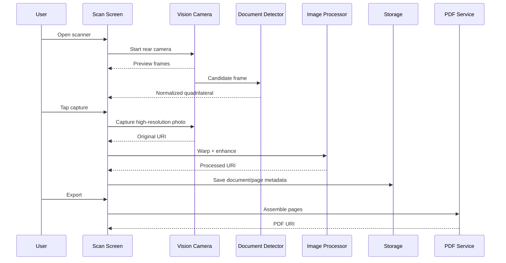

## Document geometry

The detector exposes normalized points rather than hard-coding screen dimensions.

```ts
export type Point = {
  x: number;
  y: number;
};

export type EdgePoints = {
  topLeft: Point;
  topRight: Point;
  bottomRight: Point;
  bottomLeft: Point;
};
```

A normalized point is usually represented in the `0..1` range.

This allows the same geometry to be rendered in an SVG overlay and later transformed into the captured image coordinate space.

## Coordinate transformation

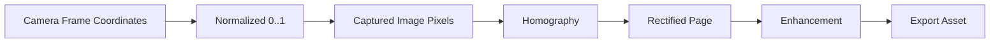

The OpenCV service is intentionally responsible for the heavy work.

It can:

* convert normalized points to absolute pixel coordinates
* compute the homography
* apply a perspective warp
* write the processed output to a cache/document path

## Quality gates

A production pipeline should reject or flag bad captures before expensive processing.

A capture-quality service can combine:

* edge confidence
* quadrilateral area relative to the frame
* corner angle sanity
* blur estimate
* exposure/shadow estimate
* text density
* motion score

Example scoring model:

```text
quality =
  0.35 * geometryScore +
  0.25 * sharpnessScore +
  0.15 * exposureScore +
  0.15 * textDensityScore +
  0.10 * stabilityScore
```

The exact weights are application policy, not a promise of model accuracy. They should be tuned using real device captures.

## Image enhancement strategy

The enhancement layer supports document-friendly transforms such as:

* grayscale
* thresholding
* denoising
* contrast improvement

The original image should be preserved so destructive edits can be reverted.

Recommended state:

```ts
type PageAsset = {
  originalUri: string;
  workingUri: string;
  enhancedUri?: string;
  filter: 'original' | 'bw' | 'enhanced' | 'grayscale';
  width: number;
  height: number;
};
```

---

# PAGE 4 — Document Data, Persistence, and Offline-First Behavior

The document layer separates metadata from the underlying binary assets.

The core scan model contains identifiers, timestamps, local thumbnail references, optional PDF references, page counts, and synchronization state.

## Local persistence model

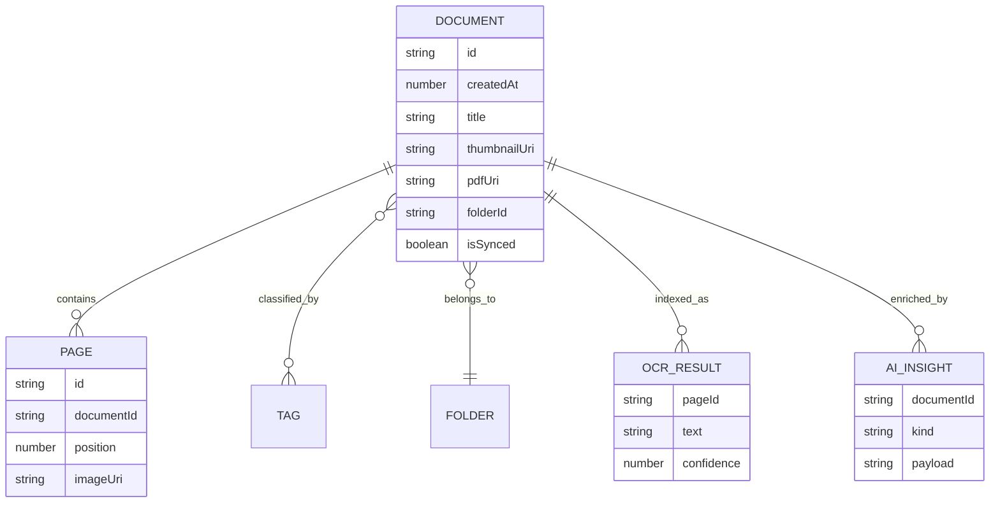

## MMKV role

MMKV is used as a synchronous metadata store.

It is a good fit for:

* document indexes
* user configuration
* feature flags
* local monetization state
* small frequently-read metadata

Large images and PDFs should remain files, not JSON blobs inside MMKV.

## Storage rules

1. Metadata should be versioned.
2. Binary assets should have deterministic ownership.
3. Deleting a document should eventually delete unreferenced files.
4. Cache paths should be safe to purge.
5. User-visible files should live in a durable document/export directory.
6. Migrations should be idempotent and observable.

## Offline-first state machine

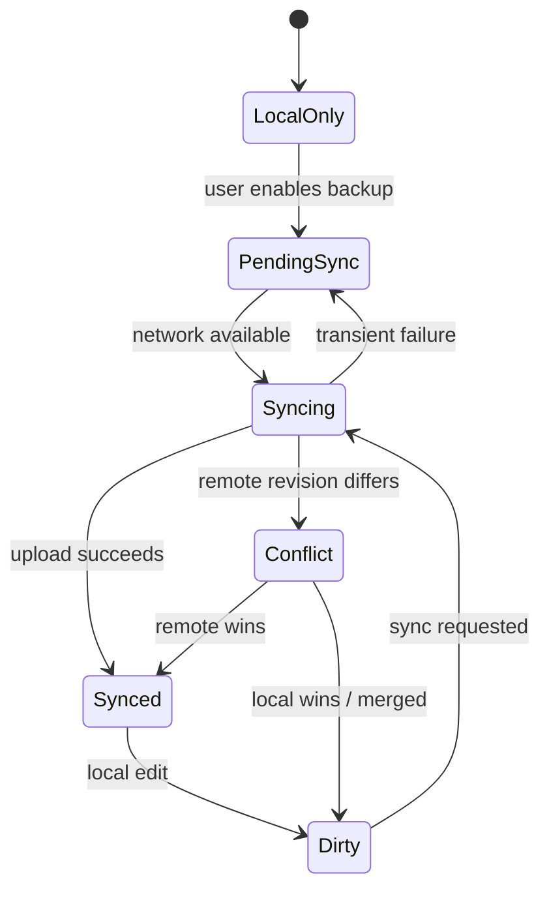

The sync branch should not overwrite a locally edited document merely because the network response arrived later.

Use:

* revisions
* hashes
* timestamps
* explicit conflict resolution

## Search indexing

The AI/OCR layer can build a derived search index from:

* OCR text
* tags
* extracted entities
* embeddings

That index is disposable.

The document remains authoritative, and a damaged index can be rebuilt.

This distinction prevents a common architectural failure where search state becomes more authoritative than the files it indexes.

---

# PAGE 5 — Advanced AI and Intelligent Documents

The AI layer is organized as a platform rather than one monolithic `AIService`.

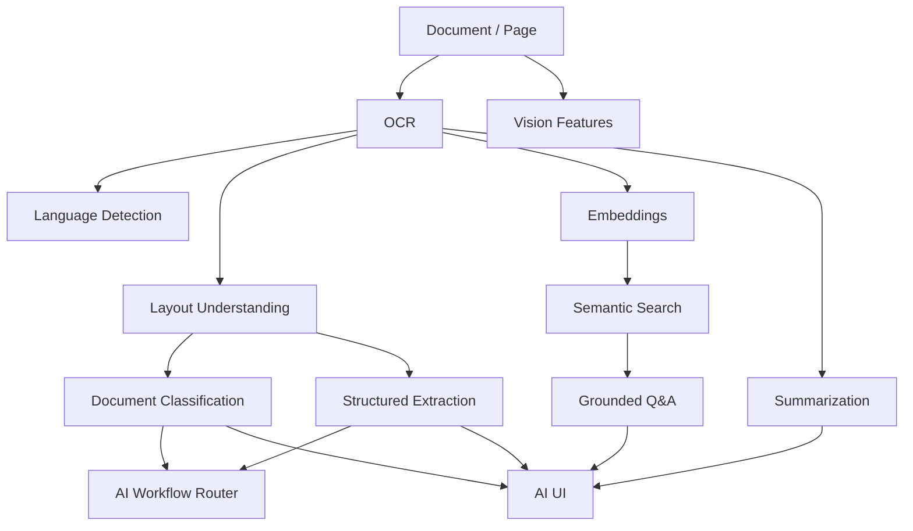

## Model routing

A useful model runtime abstraction is:

```ts
export type ModelLocation =
  | 'device'
  | 'remote';

export type ModelRequest<T> = {
  task: string;
  input: T;
  maxLatencyMs?: number;
  requireNetwork?: boolean;
};

export type ModelResponse<T> = {
  output: T;
  modelId: string;
  location: ModelLocation;
  confidence?: number;
};
```

The router can choose a device model when:

* privacy dominates
* the device is offline
* latency matters

It can choose remote models when:

* higher-capacity reasoning is needed
* consent exists
* network access is permitted

## Intelligent document flow

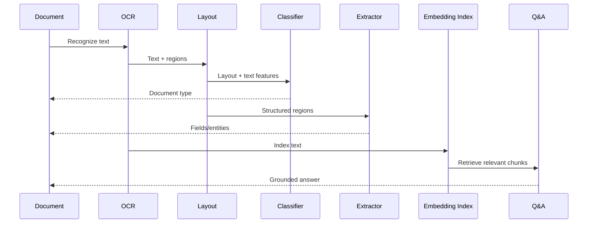

## AI safety principles

* Do not silently transmit documents to a remote model.
* Require explicit policy/consent for network AI.
* Keep model provenance with generated outputs.
* Treat OCR and extraction as potentially incorrect.
* Avoid presenting model guesses as verified document facts.
* Allow users to inspect source text/regions behind important AI results.
* Provide deterministic fallbacks when AI is unavailable.

## Useful AI capabilities

The implementation layers cover capabilities including:

* OCR post-processing
* language detection
* layout understanding
* document classification
* structured field extraction
* semantic embeddings/search
* summarization
* grounded question answering
* document graphs
* PII detection and redaction helpers
* model queues
* model caching
* evaluation
* safety
* observability

These should be treated as separate product capabilities.

The scanner and PDF exporter should continue working even when AI services are disabled.

---

# PAGE 6 — Monetization Architecture

Monetization is modeled as a first-class domain because it touches:

* product policy
* SDK integration
* UI
* analytics
* customer support

The base business model uses:

* a free tier
* five monthly export credits
* Pro access
* rewarded advertisements
* lifetime purchase support

The broader monetization layer adds:

* subscriptions
* promotions
* referrals
* pricing experiments
* churn management
* win-back logic
* revenue analytics

## Monetization architecture

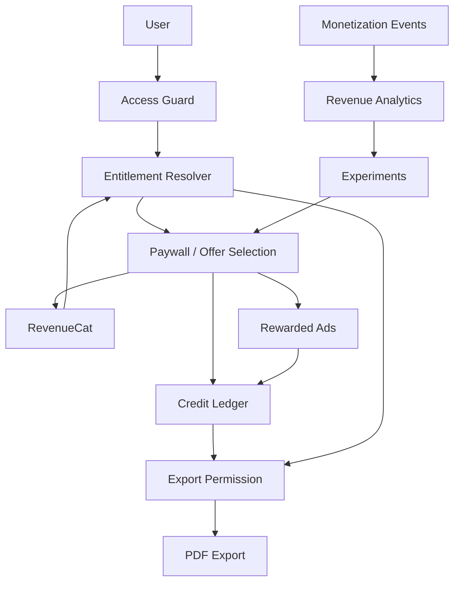

## Entitlement truth

RevenueCat is the external source of subscription entitlement state.

Local state may cache it for responsive UI, but it should not become an independent source of truth.

```ts
export type Entitlement = {
  isPro: boolean;
  tier:
    | 'free'
    | 'monthly'
    | 'yearly'
    | 'lifetime';
  expiresAt?: number;
  source:
    | 'revenuecat'
    | 'cache'
    | 'restore';
};
```

## Credit ledger

Credits are better represented as a ledger than as a single mutable integer when monetization becomes sophisticated.

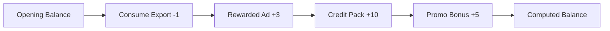

Each ledger event should have an idempotency key.

A rewarded ad callback or purchase callback must not grant the same reward twice.

## Paywall composition

The monetization UI can be assembled from:

1. product catalog
2. entitlement state
3. offer eligibility
4. ranking/anchoring policy
5. copy/messaging
6. experiment assignment
7. purchase/restore actions
8. analytics

This makes pricing tests possible without coupling experiments to the payment SDK.

---

# PAGE 7 — Paywalls, Pricing Experiments, Ads, and Retention

The monetization system includes a commercial control plane around the basic paywall.

## Offer-selection pipeline

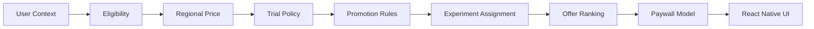

## User context

Possible inputs include:

* free/pro status
* credit balance
* scan/export count
* days since first use
* previous purchase state
* billing issue state
* experiment assignment
* locale/currency
* promotion eligibility
* recent paywall impressions
* recent rewarded-ad usage

The implementation should avoid using sensitive or unnecessary data merely because it is available.

## Pricing experiment model

```ts
export type PricingVariant = {
  id: string;

  monthlyProductId: string;
  yearlyProductId?: string;
  lifetimeProductId?: string;

  anchorMode:
    | 'none'
    | 'yearly-savings'
    | 'lifetime';

  trialDays?: number;
};
```

Use stable assignment keys so users do not randomly switch pricing variants on every render.

## Rewarded ads

The expected ad flow is:

```text
load -> ready -> show -> earned -> grant -> reload
              \-> closed / failed
```

The reward should be granted only after the SDK reports the completed reward event.

Never award credits merely because `show()` was called.

## Retention lifecycle

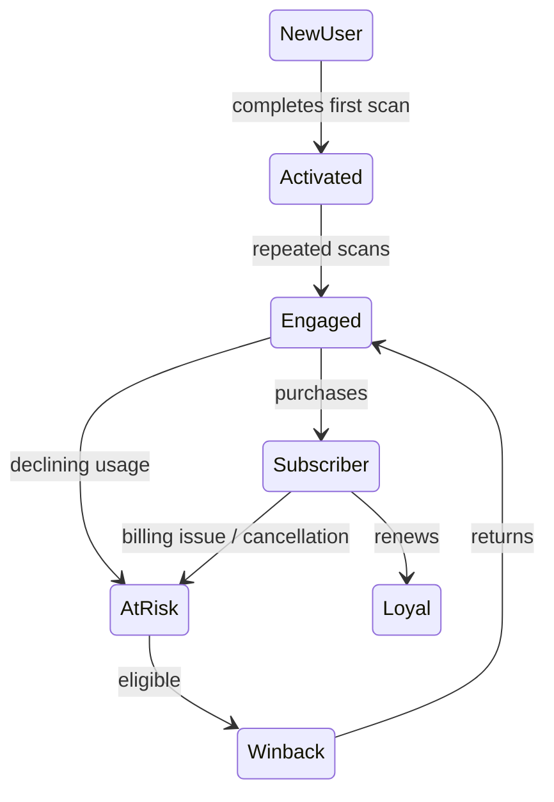

Retention features include:

* churn signals
* win-back offers
* renewal messaging
* cancellation surveys
* downgrade/pause policies
* customer-support boundaries

## Revenue analytics

Core KPIs should include:

* paywall impression count
* checkout start rate
* purchase completion rate
* restore rate
* free-to-paid conversion
* trial start/completion
* annual vs monthly mix
* rewarded-ad completion rate
* credit exhaustion rate
* churn/cancellation rate
* refund rate
* ARPU/LTV estimates
* experiment lift
* guardrail metrics

Analytics should never become a hidden dependency of billing.

A payment should still succeed when analytics transport is unavailable.

---

# PAGE 8 — Security, Privacy, Networking, and Reliability

The scanner handles potentially sensitive documents.

Security therefore applies to:

* images
* OCR
* exports
* analytics
* AI
* cloud integrations
* billing state

## Trust boundaries

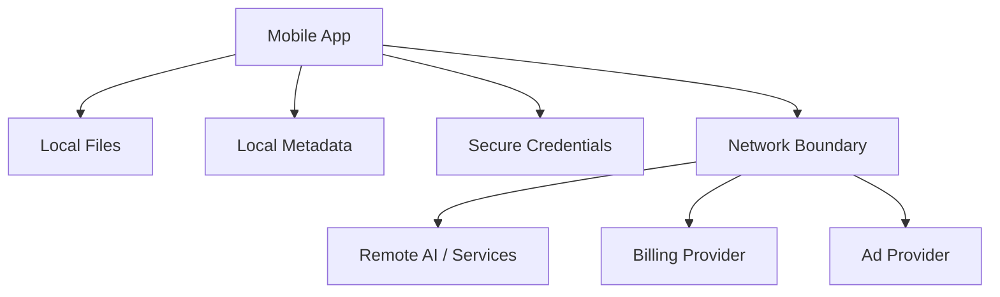

## Privacy rules

1. Camera access exists only when needed for scanning.
2. Document content stays local unless a user-enabled feature requires upload.
3. Remote AI requests should minimize payloads and obey consent settings.
4. Analytics should exclude raw document text/images.
5. Secure credentials and tokens should use platform-backed secure storage.
6. Export paths should be handled carefully to avoid accidental data leakage.

## Error taxonomy

Use typed errors so UI messaging stays stable.

```ts
export type AppErrorCode =
  | 'PERMISSION_DENIED'
  | 'CAMERA_UNAVAILABLE'
  | 'CAPTURE_FAILED'
  | 'PROCESSING_FAILED'
  | 'EXPORT_FAILED'
  | 'NETWORK_UNAVAILABLE'
  | 'AUTH_REQUIRED'
  | 'PURCHASE_CANCELLED'
  | 'PURCHASE_FAILED'
  | 'ENTITLEMENT_STALE'
  | 'AI_UNAVAILABLE';
```

## Resilience strategy

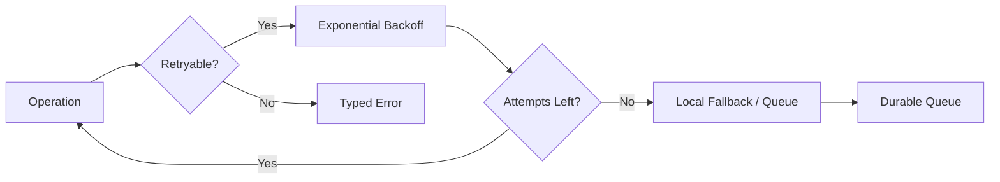

## Diagnostics

Diagnostics should record operational facts without recording document content.

Good examples:

* operation name
* duration
* platform
* SDK state
* failure code
* retry count

Bad examples:

* raw OCR text
* full scanned images
* sensitive extracted fields

## Secure export mindset

A PDF share action is a data-exfiltration boundary.

Before sharing:

* verify that the file exists
* verify its MIME type
* verify export permissions
* ensure the user intentionally requested the action

Sharing should remain explicit.

---

# PAGE 9 — Testing, CI/CD, Performance, and Release Engineering

The project contains Jest-oriented tests across core, advanced, AI, and monetization domains.

## Test pyramid

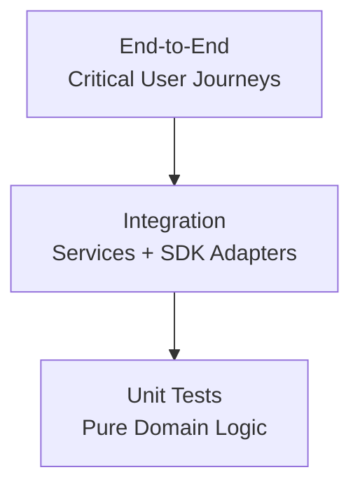

## Unit-test first candidates

Pure logic should have the highest coverage because it is cheap and deterministic.

Recommended unit-test targets:

* credit ledger calculations
* offer eligibility
* experiment assignment
* savings calculations
* entitlement mapping
* OCR normalization
* geometry utilities
* document sorting/filtering
* sync conflict resolution
* validation
* feature flags

## Integration testing

Exercise important boundaries:

* camera permission state
* file-system writes
* RevenueCat purchase/restore adapters
* rewarded-ad callbacks
* OCR fallback behavior
* local/remote AI routing
* PDF generation

Third-party SDKs should be wrapped so tests can substitute fakes.

## Performance budget

The key performance rule is:

> Avoid expensive image operations on the UI thread.

Camera frame processing should be throttled.

Native operations should release memory after use.

Useful measurements include:

```text
camera_start_ms
first_document_detection_ms
capture_to_review_ms
pdf_generation_ms
ocr_processing_ms
search_query_ms
paywall_render_ms
app_cold_start_ms
```

## CI pipeline

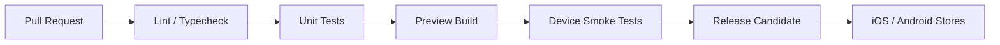

## Release checklist

Before shipping a mobile build, verify:

* camera permissions
* iOS/Android permission text
* native module compatibility
* store products
* entitlements
* production ad IDs
* test IDs removed
* restore purchase flow
* PDF export
* share path
* data migrations
* offline behavior
* analytics schemas
* privacy controls
* crash monitoring
* Pro gating
* credit reset behavior

## Native build caveat

Because the app uses native libraries such as:

* Vision Camera
* OpenCV
* ML Kit
* RevenueCat
* Google Mobile Ads
* React Native sharing

an Expo Go-only workflow is not sufficient for the complete feature set.

Use development/release builds that contain the required native modules and validate them on physical devices.

---

# PAGE 10 — Developer Guide, Contribution Rules, and Roadmap

## Installation

```bash
npm install

# Start Metro / Expo
npm run start

# Native development builds
npm run ios
npm run android

# Tests
npm test

# Lint
npm run lint
```

## Environment configuration

The repository provides an `.env.example` containing placeholders for platform-specific RevenueCat credentials and rewarded-ad configuration.

```env
EXPO_PUBLIC_REVENUECAT_IOS=
EXPO_PUBLIC_REVENUECAT_ANDROID=
EXPO_PUBLIC_ADMOB_REWARDED=
```

Never commit real production secrets to Git.

Use:

* CI/CD secret stores
* native build configuration
* secure environment management

## Contribution rules

### 1. Keep SDKs behind adapters

Do not import RevenueCat, OpenCV, ML Kit, or ad SDKs throughout unrelated components when a domain service already exists.

### 2. Keep binary data out of global state

Global stores should track:

* metadata
* IDs
* status
* workflow state

Large files should remain in the filesystem.

### 3. Make async work cancellable

Capture, OCR, AI inference, and PDF generation may outlive a screen.

Unmounted screens should not produce orphaned state updates.

### 4. Make monetization idempotent

Purchase callbacks, restore flows, rewards, and credit grants may be delivered more than once.

Use:

* transaction IDs
* idempotency keys
* event IDs

### 5. Keep AI outputs attributable

Store:

* model/strategy
* confidence where available
* source document/page references

Important generated insights should remain traceable back to their inputs.

### 6. Fail safely

The user should still be able to:

* capture
* browse
* manage
* export

documents when optional AI, analytics, ads, or remote services are unavailable.

---

# End-to-End Platform Architecture

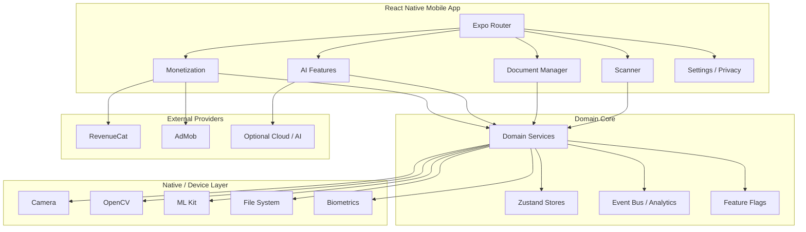

---

# Recommended Development Roadmap

## Phase 1 — Harden the capture path

Focus on:

* device-specific camera framing
* document detection reliability
* corner mapping
* perspective warp validation
* memory cleanup
* capture-quality feedback

## Phase 2 — Harden document storage

Add:

* migrations
* file-reference integrity checks
* duplicate detection
* deterministic cleanup
* import/export backups

## Phase 3 — Ship OCR/search as a stable product

Treat OCR as a first-class document derivative.

Start with:

* OCR persistence
* rebuildable indexes
* text search
* metadata extraction

before adding more complex semantic experiences.

## Phase 4 — Introduce AI progressively

Start with low-risk assistance:

* classification
* summaries
* metadata suggestions

Then add:

* structured extraction
* semantic search
* grounded Q&A

Always expose source references for important generated information.

## Phase 5 — Optimize monetization

Validate product value before increasing paywall pressure.

Instrument:

* funnel
* pricing
* paywall behavior
* credits
* ads
* retention

Run controlled experiments and keep all purchase/reward events idempotent.

## Phase 6 — Production operations

Add:

* crash monitoring
* device-matrix testing
* remote configuration safeguards
* privacy audits
* app-store compliance review
* automated release workflows

---

# Final Architecture Principle

The most important design choice in this project is not any individual SDK.

It is the separation of concerns:

```text
                     USER INTENT
                          |
                          v
                  React Native UI
                          |
                          v
                Domain / Feature Layer
               /          |           \
              v           v            v
           Scanner       AI       Monetization
              |           |            |
              +-----------+------------+
                          |
                          v
                    Adapter Layer
              /        |       |        \
             v         v       v         v
          Camera      CV     Billing    Network
```

This boundary keeps the mobile app adaptable.

Camera libraries can change.

AI providers can change.

Pricing can change.

Storage strategies can evolve.

None of those changes should require rewriting every screen.

---

# Key Commands

```bash
npm install
npm run start
npm run ios
npm run android
npm test
npm run lint
```

---

# Project Documentation

Recommended documentation structure:

```text
docs/
  architecture.md
  testing.md
  release.md
  monetization.md
  ai.md
  privacy.md
  security.md
  sync.md
```

Useful project references include:

* `docs/architecture.md`
* `docs/testing.md`
* `docs/release.md`
* monetization implementation documentation
* AI implementation documentation
* native adapter documentation

---

# Security Checklist

Before production release:

* [ ] No secrets committed
* [ ] Production API keys are secured
* [ ] Secure storage is configured
* [ ] Camera permissions are reviewed
* [ ] Document data remains local by default
* [ ] Remote AI requires consent where applicable
* [ ] Analytics excludes document contents
* [ ] Export actions are explicit
* [ ] Billing callbacks are idempotent
* [ ] Rewarded-ad rewards are validated
* [ ] Store receipt/entitlement handling is tested
* [ ] Crash logs do not contain document data

---

# Monetization Checklist

* [ ] Free tier configured
* [ ] Monthly/yearly plans configured
* [ ] Lifetime product configured
* [ ] RevenueCat entitlements mapped
* [ ] Purchase restoration tested
* [ ] Paywall experiments stable
* [ ] Rewarded ad reward flow tested
* [ ] Credit ledger idempotent
* [ ] Subscription expiry behavior tested
* [ ] Cancellation state tested
* [ ] Win-back eligibility tested
* [ ] Revenue analytics validated
* [ ] Production ad IDs configured

---

# AI Checklist

* [ ] OCR fallback exists
* [ ] AI provider abstraction exists
* [ ] Local/remote routing is explicit
* [ ] Remote processing requires policy/consent
* [ ] Generated results retain provenance
* [ ] AI confidence is surfaced where appropriate
* [ ] Search index can be rebuilt
* [ ] PII detection is tested
* [ ] Redaction is deterministic
* [ ] AI failures do not block scanning
* [ ] Model changes can be versioned

---

# Performance Checklist

* [ ] Frame processing is throttled
* [ ] Heavy image operations are native/off-thread
* [ ] Image dimensions are controlled
* [ ] OpenCV resources are released
* [ ] Large binaries stay out of Zustand/MMKV
* [ ] PDF generation is asynchronous
* [ ] Search indexing does not block navigation
* [ ] AI jobs can be queued/cancelled
* [ ] Cache eviction exists
* [ ] Device testing covers low-memory hardware

---

# License

Add the project's actual license before publishing this repository publicly.

Also review the licenses and redistribution terms of:

* native libraries
* third-party SDKs
* AI providers
* fonts
* icon libraries
* ad/billing integrations

before distributing the app commercially.

```

This README is based on the existing project README and architecture you provided, including its stated React Native/Expo stack, scanner pipeline, AI layer, persistence model, monetization system, security boundaries, and release workflow. :contentReference[oaicite:0]{index=0}
```
